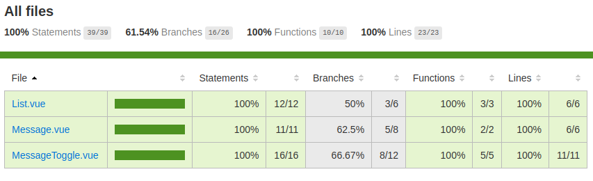

# Простой проект для пробы возможностей Vue

## Тестирование, сборка и запуск

Установка:

````bash
yarn install
````

Тесты (использован jest):

````bash
yarn test
````

Покрытие тестами

````bash
yarn test --coverage
````

Отчет:

````
-------------------|----------|----------|----------|----------|-------------------|
File               |  % Stmts | % Branch |  % Funcs |  % Lines | Uncovered Line #s |
-------------------|----------|----------|----------|----------|-------------------|
All files          |      100 |    61.54 |      100 |      100 |                   |
 List.vue          |      100 |       50 |      100 |      100 |             21,22 |
 Message.vue       |      100 |     62.5 |      100 |      100 |             18,19 |
 MessageToggle.vue |      100 |    66.67 |      100 |      100 |          12,46,47 |
-------------------|----------|----------|----------|----------|-------------------|
````

Тут же формируется отчет в формате html в папке ./coverage/lcov-report



Запуск:

````bash
yarn run dev
````

Экран программы:


>[!NOTE]
Для тестирования используется [Jest](https://jestjs.io/ru/). [Docs for vue-test-utils](https://vue-test-utils.vuejs.org/guides/#testing-single-file-components-with-jest).

>[!NOTE]
>## Примечания о vue-test-utils-jest-example
>
> Example project using Jest + vue-test-utils together
>
>This is based on the `vue-cli` `webpack-simple` template. Test-specific changes include:
>
>## Additional Dependencies
>
>- `vue-test-utils`
>- `jest`
>- `babel-jest` (for ES2015+ features in tests)
>- `vue-jest` (for handling `*.vue` files in tests)
>- `jest-serializer-vue` (for snapshot tests)
>
>## Additional Configuration
>
>### `package.json`
>
>The following configurations are recommended for Jest:
>
>``` js
>{
>  "jest": {
>    "moduleFileExtensions": [
>      "js",
>      "json",
>      // tell Jest to handle *.vue files
>      "vue"
>    ],
>    "transform": {
>      // process js with babel-jest
>      "^.+\\.js$": "<rootDir>/node_modules/babel-jest",
>      // process *.vue files with vue-jest
>      ".*\\.(vue)$": "<rootDir>/node_modules/vue-jest"
>    },
>    // support the same @ -> src alias mapping in source code
>    "moduleNameMapper": {
>      "^@/(.*)$": "<rootDir>/src/$1"
>    },
>    // serializer for snapshots
>    "snapshotSerializers": [
>      "<rootDir>/node_modules/jest-serializer-vue"
>    ]
>  }
>}
>```
>
>### `.babelrc`
>
>Our default Babel config disables ES modules transpilation because webpack already >knows how to handle ES modules. However, we do need to enable it for our tests because >Jest tests are run directly in Node.
>
>Also, if our tests are run in a relatively newer version of Node, most of the ES >features are already supported - we can tell `babel-preset-env` to target the Node >version we are using. This skips transpiling unnecessary features and makes our tests >boot faster.
>
>To apply these options only for tests, we need to add a separate config under `env.>test` (this will be automatically picked up by `babel-jest`):
>
>````json
>{
>  "presets": [
>    ["env", { "modules": false }]
>  ],
>  "env": {
>    "test": {
>      "presets": [
>        ["env", { "targets": { "node": "current" }}]
>      ]
>    }
>  }
>}
>````
